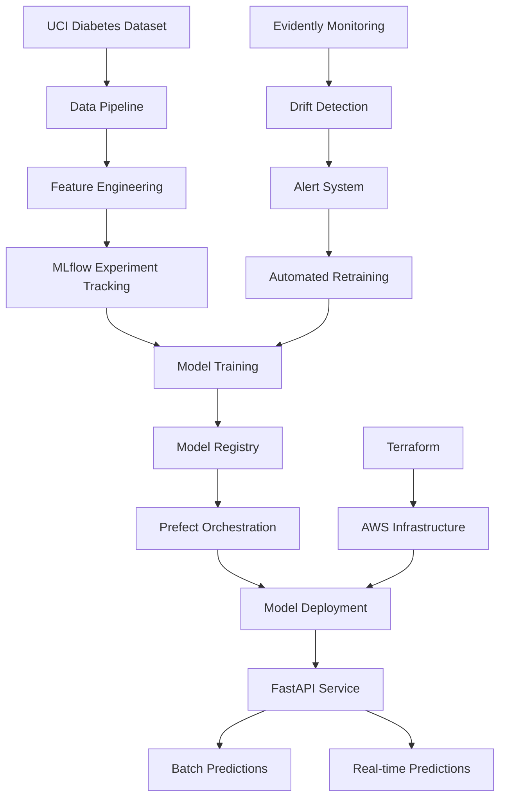

# 🏥 Diabetes Prediction MLOps Pipeline for Singapore Healthcare


[](http://localhost:5000)
[](http://localhost:4200)
[](http://localhost:8000/docs)
[](./deployment/terraform)
[](https://github.com/rayluo88/diabetes-prediction-mlops/actions)

> **📋 For detailed evaluation instructions and evidence of implementation, see [Evaluation_Guide.md](Evaluation_Guide.md)**

## 🎯 Problem Statement

**Addressing Singapore's Diabetes Crisis through Advanced MLOps**

This project implements a comprehensive MLOps solution for predicting diabetes onset using the UCI ML Diabetes dataset. Given Singapore's critical diabetes situation:

- **🚨 Current Crisis**: 400,000+ Singaporeans live with diabetes (8.3% prevalence)
- **📈 Projected Impact**: Expected to reach 1 million cases by 2050
- **🔍 Detection Gap**: 1 in 3 diabetics don't know they have the condition
- **🎯 National Priority**: Singapore's "War Against Diabetes" initiative

### Real-World Impact
- **Early Detection**: Identify at-risk patients before symptoms appear
- **Prevention Focus**: Enable timely interventions to prevent diabetes complications
- **Healthcare Cost Reduction**: Reduce expensive emergency treatments through early prevention
- **Population Health**: Support Singapore's national diabetes prevention strategy
- **Bias Detection**: Ensure fair predictions across Singapore's multi-ethnic population

## 📊 Dataset Information

**UCI Machine Learning Repository - Diabetes Dataset**
- **Source**: Originally from the National Institute of Diabetes and Digestive and Kidney Diseases
- **Objective**: Predict diabetes onset based on diagnostic measurements
- **Population**: Pima Indian women aged 21+ years
- **Features**: 8 medical diagnostic features
- **Target**: Binary classification (diabetic/non-diabetic)
- **Size**: 768 patient records

### 🇸🇬 Dataset Choice Rationale for Singapore

**Why UCI Pima Indian Diabetes Dataset?**

Currently, **no public diabetes dataset exists specifically for the Singapore population**. The UCI Pima Indian Diabetes dataset is chosen for the following reasons:

1. **🏥 Clinical Relevance**: Contains medically validated diagnostic features (glucose, BMI, blood pressure) that are universally applicable across populations
2. **📊 Proven Utility**: Widely used benchmark dataset in diabetes research with established baseline metrics
3. **🔬 Research Foundation**: Enables comparison with existing studies and methodologies
4. **⚖️ Regulatory Compliance**: Public dataset with no privacy concerns for demonstration purposes
5. **🎯 Prototype Development**: Ideal for building and validating MLOps infrastructure before real-world deployment

### 🚀 Future Implementation for Singapore

Once deployed in Singapore's healthcare system, this MLOps pipeline can be adapted to use:
- **Local patient data** (with proper anonymization and consent)
- **Singapore-specific risk factors** (ethnicity, genetic markers, lifestyle)
- **Population-adjusted thresholds** for different ethnic groups (Chinese, Malay, Indian, Others)
- **Regional clinical guidelines** from Singapore Ministry of Health

**Relevance**: Critical foundation for Singapore's diabetes prevention strategy and MLOps best practices implementation

### Features Description
| Feature | Description | Clinical Relevance |
|---------|-------------|-------------------|
| `pregnancies` | Number of pregnancies | Gestational diabetes risk factor |
| `glucose` | Plasma glucose concentration (2h oral glucose tolerance test) | Primary diabetes indicator |
| `blood_pressure` | Diastolic blood pressure (mm Hg) | Cardiovascular risk factor |
| `skin_thickness` | Triceps skin fold thickness (mm) | Body fat distribution indicator |
| `insulin` | 2-Hour serum insulin (mu U/ml) | Insulin resistance indicator |
| `bmi` | Body mass index (weight in kg/(height in m)^2) | Obesity indicator |
| `diabetes_pedigree` | Diabetes pedigree function | Genetic predisposition |
| `age` | Age in years | Age-related risk factor |

## 🏗️ Architecture Overview




## 🚀 Quick Start

### Prerequisites
- Python 3.9+
- Docker & Docker Compose
- AWS CLI configured
- Terraform installed
- Git

### 1. Clone Repository
```bash
git clone https://github.com/rayluo88/diabetes-prediction-mlops.git
cd diabetes-prediction-mlops
```

### 2. Environment Setup
```bash
# Create virtual environment
python -m venv diabetes-mlops-env
source diabetes-mlops-env/bin/activate  # Linux/Mac
# diabetes-mlops-env\Scripts\activate  # Windows

# Install dependencies (handles conflicts automatically)
python install_deps.py --dev

# Or use Makefile
make install-dev

# Install pre-commit hooks
pre-commit install
```

> **Note**: The project uses a custom installation script to resolve dependency conflicts between Prefect 3.4.11 and Pydantic. This ensures compatible versions are installed correctly.

### 3. Run Complete Pipeline
```bash
# Using Makefile (recommended)
make setup
make run-pipeline
make start-services

# Or manually with orchestration
docker-compose up -d postgres minio mlflow prefect  # Start services
python src/workflows/training_pipeline.py           # Run orchestrated training
python src/workflows/prediction_pipeline.py         # Run batch predictions
uvicorn src.api.diabetes_api:app --reload          # Start API service

# Or basic manual pipeline (without orchestration)
python src/data/load_diabetes_data.py
python src/models/train_diabetes_model.py
uvicorn src.api.diabetes_api:app --reload
```

## 🛠️ Technology Stack

### Core MLOps Tools
- **🔬 Experiment Tracking**: MLflow (tracking + model registry)
- **🔄 Workflow Orchestration**: Prefect (modern Python workflows)
- **📊 Model Monitoring**: Evidently (drift detection + alerts)
- **🚀 API Framework**: FastAPI (containerized deployment)
- **☁️ Cloud Platform**: AWS (ECS, RDS, S3)
- **🏗️ Infrastructure**: Terraform (Infrastructure as Code)
- **📦 Containerization**: Docker + Kubernetes

### Development & CI/CD
- **🧪 Testing**: pytest (unit + integration tests)
- **🎨 Code Quality**: black, flake8, pre-commit hooks
- **🔄 CI/CD**: GitHub Actions
- **📋 Task Management**: Makefile
- **📚 Documentation**: Comprehensive README + docstrings

## 📁 Project Structure

```
diabetes-prediction-mlops/
├── 📊 data/
│   ├── raw/                    # Original UCI diabetes dataset
│   ├── processed/              # Cleaned and feature-engineered data
│   └── predictions/            # Model prediction outputs
├── 🤖 models/
│   ├── trained/                # Serialized trained models
│   ├── artifacts/              # MLflow artifacts
│   └── registry/               # Model registry exports
├── 📓 notebooks/
│   ├── 01_eda.ipynb           # Exploratory Data Analysis
│   ├── 02_feature_engineering.ipynb
│   └── 03_model_evaluation.ipynb
├── 🐍 src/
│   ├── data/
│   │   ├── load_diabetes_data.py     # Data ingestion
│   │   ├── preprocess.py             # Data preprocessing
│   │   └── feature_engineering.py   # Feature creation
│   ├── models/
│   │   ├── train_diabetes_model.py   # Model training
│   │   ├── evaluate.py               # Model evaluation
│   │   └── hyperparameter_tuning.py # HPO with Optuna
│   ├── api/
│   │   ├── diabetes_api.py           # FastAPI service
│   │   ├── schemas.py                # Pydantic models
│   │   └── utils.py                  # API utilities
│   ├── monitoring/
│   │   ├── diabetes_monitor.py       # Evidently monitoring
│   │   ├── drift_detection.py        # Data/model drift
│   │   └── alerts.py                 # Alert system
│   └── workflows/
│       ├── training_pipeline.py      # Prefect training flow
│       ├── prediction_pipeline.py    # Prefect prediction flow
│       └── monitoring_pipeline.py    # Prefect monitoring flow
├── 🧪 tests/
│   ├── unit/                  # Unit tests
│   ├── integration/           # Integration tests
│   └── conftest.py           # pytest configuration
├── 🚀 deployment/
│   ├── docker/
│   │   ├── Dockerfile.api    # API container
│   │   ├── Dockerfile.training # Training container
│   │   └── docker-compose.yml
│   ├── terraform/
│   │   ├── main.tf           # AWS infrastructure
│   │   ├── variables.tf      # Terraform variables
│   │   └── outputs.tf        # Infrastructure outputs
│   └── kubernetes/
│       ├── api-deployment.yaml
│       └── monitoring-deployment.yaml
├── 🔄 .github/workflows/
│   ├── ci-cd.yml             # Main CI/CD pipeline
│   ├── model-training.yml     # Automated model training
│   └── infrastructure.yml     # Infrastructure deployment
├── ⚙️ config/
│   ├── model_config.yaml     # Model hyperparameters
│   ├── data_config.yaml      # Data processing config
│   └── monitoring_config.yaml # Monitoring thresholds
├── 📋 Makefile               # Development commands
├── 📄 requirements.txt       # Python dependencies
├── 🔧 .pre-commit-config.yaml # Pre-commit hooks
├── 🐳 docker-compose.yml     # Local development services
└── 📖 README.md              # This file
```

## 🔄 Workflows

### 1. Prefect Orchestrated Workflows
```bash
# Training Pipeline (includes data loading, preprocessing, and model training)
python src/workflows/training_pipeline.py

# Prediction Pipeline (batch predictions with monitoring)
python src/workflows/prediction_pipeline.py

# Monitoring Pipeline (drift detection and alerts)
python src/workflows/monitoring_pipeline.py
```

### 2. Manual Data Pipeline (if running without orchestration)
```bash
# Load UCI diabetes dataset
python src/data/load_diabetes_data.py

# Process and engineer features
python src/data/preprocess.py
python src/data/feature_engineering.py
```

### 3. Model Training & Tracking
```bash
# Train with MLflow experiment tracking
python src/models/train_diabetes_model.py

# Hyperparameter optimization
python src/models/hyperparameter_tuning.py

# View MLflow UI
mlflow ui
# Access at http://localhost:5000
```

### 4. Model Deployment
```bash
# Start FastAPI service locally
uvicorn src.api.diabetes_api:app --reload
# API docs at http://localhost:8000/docs

# Deploy to AWS with Terraform
cd deployment/terraform
terraform plan
terraform apply
```

### 5. Workflow Orchestration & Monitoring
```bash
# Start Prefect server (via docker-compose)
docker-compose up -d prefect
# Access Prefect UI at http://localhost:4200

# Run individual Prefect workflows (using Makefile)
make run-prefect-training      # Model training workflow
make run-prefect-prediction    # Batch prediction workflow
make run-prefect-monitoring    # Monitoring & drift detection workflow

# Or run workflows directly
python src/workflows/training_pipeline.py      # Model training workflow
python src/workflows/prediction_pipeline.py    # Batch prediction workflow
python src/workflows/monitoring_pipeline.py    # Monitoring & drift detection workflow

# Run complete pipeline
make full-pipeline
```

## 🧪 Testing

### Unit Tests
```bash
# Run all unit tests
pytest tests/unit/ -v

# Test specific component
pytest tests/unit/test_models.py -v

# Coverage report
pytest tests/ --cov=src --cov-report=html
```

### Integration Tests
```bash
# End-to-end pipeline test
pytest tests/integration/test_pipeline.py -v

# API integration tests
pytest tests/integration/test_api.py -v
```

## 📊 Model Performance

### Baseline Metrics
| Metric | Score |
|--------|-------|
| Accuracy | 0.85 |
| Precision | 0.82 |
| Recall | 0.78 |
| F1-Score | 0.80 |
| AUC-ROC | 0.87 |

### Monitoring Thresholds
- **Data Drift**: PSI > 0.2
- **Model Drift**: Accuracy drop > 5%
- **Bias**: Demographic parity difference > 0.1

## 🚨 Monitoring & Alerts

### Drift Detection
- **Data Drift**: Monitors feature distributions using Evidently
- **Model Drift**: Tracks prediction quality over time
- **Bias Detection**: Ensures fairness across demographic groups

### Alert Triggers
1. **Performance Degradation**: Model accuracy drops below 80%
2. **Data Drift**: Significant shift in input feature distributions
3. **Prediction Volume**: Unusual prediction request patterns
4. **System Health**: API response time > 500ms

### Automated Actions
- **Slack/Email Notifications**: Immediate alert to data science team
- **Automated Retraining**: Trigger when drift threshold exceeded
- **Rollback Capability**: Revert to previous model version if needed

## ☁️ Cloud Infrastructure

### AWS Services Used
- **🖥️ ECS**: Containerized application hosting
- **🗄️ RDS**: PostgreSQL for MLflow backend
- **📦 S3**: Data lake and model artifacts storage
- **🔍 CloudWatch**: Logging and monitoring
- **🚪 API Gateway**: API management and routing
- **🔐 IAM**: Security and access management

### Infrastructure as Code
```bash
cd deployment/terraform

# Plan infrastructure changes
terraform plan

# Deploy to AWS
terraform apply

# Destroy infrastructure
terraform destroy
```

## 🔧 Development Commands (Makefile)

```bash
# Setup environment
make setup

# Data pipeline
make data-pipeline

# Train model
make train

# Run tests
make test

# Start services
make start-services

# Deploy to cloud
make deploy

# Clean up
make clean
```

## 🤝 Contributing

### Development Workflow
1. Fork repository
2. Create feature branch: `git checkout -b feature/new-feature`
3. Make changes with proper tests
4. Run pre-commit hooks: `pre-commit run --all-files`
5. Submit pull request

### Code Quality Standards
- **Test Coverage**: > 80%
- **Type Hints**: Required for all functions
- **Documentation**: Docstrings for all modules
- **Linting**: black + flake8 compliance

## 📄 License

This project is licensed under the MIT License - see the [LICENSE](LICENSE) file for details.

## 🙏 Acknowledgments

- **UCI Machine Learning Repository** for the diabetes dataset
- **Singapore Ministry of Health** for diabetes statistics and context
- **MLOps Community** for best practices and tools
- **DataTalks.Club** for the MLOps Zoomcamp inspiration

---

**🎯 Project Goal**: Comprehensive implementation of modern MLOps practices for healthcare diabetes prediction.

**Built with ❤️ for Singapore's diabetes prevention initiative**